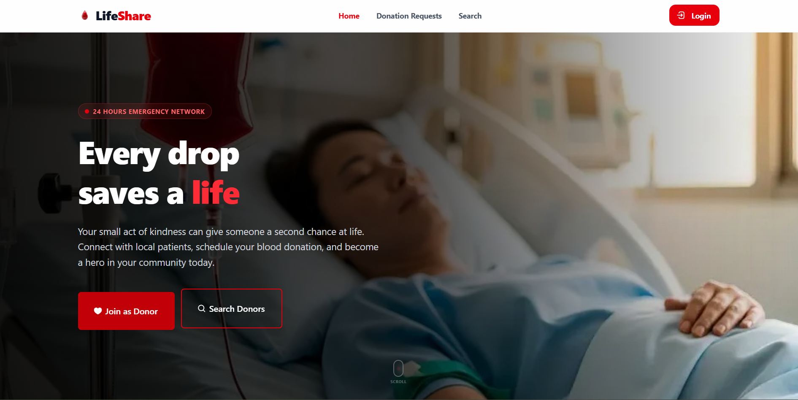

# 🩸 LifeShare - Blood Donation Platform

## 📌 Project Purpose
LifeShare is a comprehensive and modern web application designed to bridge the gap between voluntary blood donors and people in critical need. It streamlines the process of creating blood donation requests, searching for available donors based on specific locations, and managing donation activities through role-based dashboards. Our mission is to make finding a blood donor as quick and effortless as possible to save lives.

## 🔗 Live URL
**Live Website:** https://life-share-steel.vercel.app

## ✨ Key Features
- **Role-Based Dashboards:** Distinct and secure dashboards for Admins, Volunteers, and Donors.
- **Advanced Donor Search:** Publicly accessible search page allowing users to find donors by Blood Group, District, and Upazila.
- **Authentication & Security:** Secure login/registration system with JWT (JSON Web Token) implementation and HttpOnly cookies for protecting private APIs.
- **Dynamic Profile Management:** Users can update their personal details, location, and upload avatars seamlessly.
- **Donation Request Management:** Donors and Admins can create, view, edit, update statuses (Pending, In Progress, Done, Canceled), and delete donation requests.
- **Real-time Notifications:** Beautiful toast notifications for user actions (login, delete, update).
- **Fully Responsive UI:** A clean, modern, and 100% mobile-friendly user interface built with Tailwind CSS.

## 🛠️ Tech Stack & NPM Packages Used
This project is built using **Next.js (App Router)** and React. Below are the key NPM packages utilized:

- **Framework & Core:**
  - `next` (v14/v15 - App Router)
  - `react` & `react-dom`
- **Styling & UI Components:**
  - `tailwindcss` (Utility-first CSS framework)
  - `lucide-react` (Beautiful and consistent icons)
  - `react-toastify` (For elegant push notifications and alerts)
- **Authentication & Security:**
  - `jsonwebtoken` (For creating and verifying JWT tokens to secure APIs)
- **External APIs & Data:**
  - `ImgBB API` (For handling user avatar image uploads)
  - `Bangladesh Geocode JSON` (For fetching District and Upazila data dynamically)

## 🚀 Getting Started (Local Development)

1. **Clone the repository:**
   ```bash
   git clone https://github.com/farabi-x09/Life-Share
   cd life-share